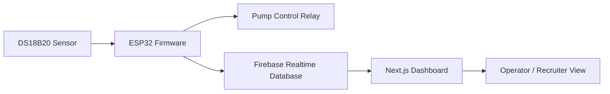

# Smart Aeration System

An end-to-end IoT project for intelligent water temperature management, combining embedded control, cloud telemetry, and a live web dashboard.

This project reflects my trajectory toward a career in AI + robotics: building reliable sensing and control loops first, then layering predictive behavior and data-driven monitoring on top. This project was developed as my group project for ITT569, Internet of Things.

## Project Summary

The system reads real-time temperature from an ESP32-based device, predicts short-term temperature trend, and proactively controls a pump to keep water conditions stable.

Sensor and activity data are streamed to Firebase Realtime Database, then visualized in a Next.js dashboard.

## Why This Project

I wanted to build something practical that sits at the intersection of:

- Embedded systems
- Real-time decision making
- Cloud-connected telemetry
- Human-readable monitoring interfaces

It is intentionally scoped as a strong foundation for future AI and robotics extensions.

## Current Capabilities

- Real-time water temperature measurement using DS18B20
- Predictive trigger logic using rolling-window linear regression
- Early pump activation based on forecasted threshold crossing
- Cloud logging to Firebase Realtime Database
- Live dashboard with:
  - Current temperature and forecasted temperature
  - Slope trend visualization
  - Recent system activity logs

Note: OLED display code remains in the firmware source as a legacy path from earlier prototypes, but it is not used in the final deployed version.

## System Architecture



## Repository Structure

- firmware: ESP32 firmware (PlatformIO + Arduino)
- dashboard: Next.js dashboard consuming Firebase data

## Tech Stack

- Firmware:
  - ESP32 (Arduino framework)
  - PlatformIO
  - OneWire + DallasTemperature
  - Adafruit SSD1306 + GFX
  - WiFi + HTTPClient
- Dashboard:
  - Next.js 16 (App Router)
  - React 19 + TypeScript
  - Firebase JS SDK (Realtime Database)
  - Tailwind CSS 4

## Quick Start

### 1) Firmware Setup

1. Open the firmware folder in VS Code with PlatformIO extension installed.
2. Create your secret configuration file at firmware/include/secrets.h.
3. Use this template:

```cpp
#ifndef SECRETS_H
#define SECRETS_H

#define WIFI_SSID "YOUR_WIFI_SSID"
#define WIFI_PASSWORD "YOUR_WIFI_PASSWORD"
#define FIREBASE_URL_SENSOR "https://YOUR_PROJECT.firebaseio.com/devices/esp32_01/sensors.json"
#define FIREBASE_URL_LOGS "https://YOUR_PROJECT.firebaseio.com/devices/esp32_01/logs.json"

#endif
```

4. Build and upload from PlatformIO.

Default board target in this project:

- esp32doit-devkit-v1

### 2) Dashboard Setup

1. Go to the dashboard folder.
2. Install dependencies:

```bash
npm install
```

3. Create dashboard/.env.local:

```env
NEXT_PUBLIC_FIREBASE_API_KEY=YOUR_KEY
NEXT_PUBLIC_FIREBASE_AUTH_DOMAIN=YOUR_DOMAIN
NEXT_PUBLIC_FIREBASE_DATABASE_URL=YOUR_DATABASE_URL
NEXT_PUBLIC_FIREBASE_PROJECT_ID=YOUR_PROJECT_ID
NEXT_PUBLIC_FIREBASE_STORAGE_BUCKET=YOUR_BUCKET
NEXT_PUBLIC_FIREBASE_MESSAGING_SENDER_ID=YOUR_SENDER_ID
NEXT_PUBLIC_FIREBASE_APP_ID=YOUR_APP_ID
```

4. Run the dashboard:

```bash
npm run dev
```

5. Open http://localhost:3000.

## Firebase Data Shape

The firmware currently writes to this structure:

```json
{
  "devices": {
    "esp32_01": {
      "sensors": {
        "temperature": 30.4,
        "predictedTemp": 34.1,
        "slope": 0.215,
        "pumpState": true,
        "timestamp": 1720000000000
      },
      "logs": {
        "-Oabc123": {
          "log": "Predictive trigger: Temp rising fast. Pump activated early.",
          "timestamp": 1720000000000
        }
      }
    }
  }
}
```

## AI + Robotics Roadmap

Planned upgrades to align this project with AI and robotics workflows:

- Add multi-sensor fusion (temperature, dissolved oxygen, pH)
- Train a small forecasting model (TinyML-compatible) for edge inference
- Add anomaly detection for pump faults and thermal instability
- Integrate actuator control as a closed-loop robotics behavior policy
- Add ROS 2 bridge for integration with larger autonomous systems

## Recruiter Notes

This repository demonstrates:

- Hardware-software integration
- Predictive control thinking (not just threshold control)
- Cloud-connected IoT architecture
- Full-stack implementation from firmware to frontend

I am actively building toward AI + robotics roles, especially where embedded intelligence, autonomous systems, and real-world deployment intersect.

## Security Note

Do not commit credentials or secrets. Use local secret files only:

- firmware/include/secrets.h
- dashboard/.env.local

## License

Add your preferred license here (for example: MIT).
